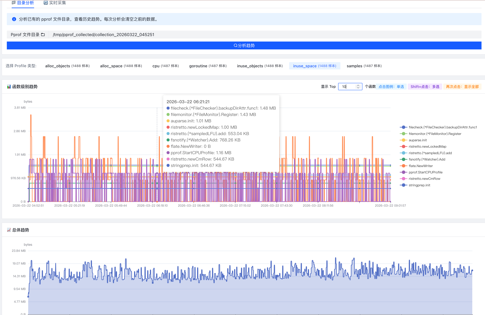
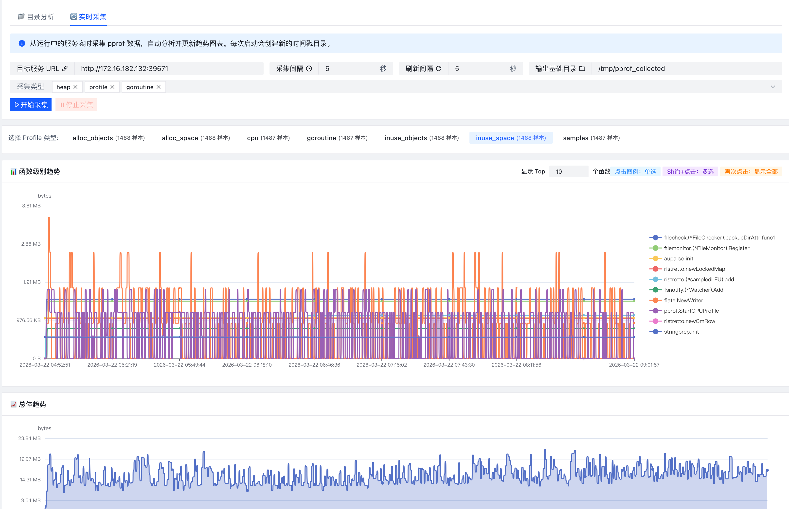

# Pprof Trend Analyzer

一个功能强大的 Golang pprof 趋势分析工具，支持目录分析和实时采集两种模式。




## ✨ 主要功能

### 1. 📁 目录分析模式
- 分析已有的 pprof 文件目录
- 支持所有 pprof sample types（inuse_space, alloc_space, inuse_objects, alloc_objects 等）
- 自动识别文件时间戳，按时间排序
- 每次分析自动清空之前的数据

### 2. 🔄 实时采集模式
- 从运行中的服务实时采集 pprof 数据
- 支持多种 profile 类型：heap, profile, goroutine, allocs, block, mutex
- 可配置采集间隔（1-3600 秒）
- 可配置前端刷新间隔（1-60 秒）
- 每次启动自动创建带时间戳的独立目录（如 collection_20260322_150405）
- 增量分析：只分析新采集的文件，不重复分析已有文件
- 实时更新图表

### 3. 📊 可视化功能
- **函数级别趋势图**：显示 Top N 函数的时间趋势（可配置 5-50）
- **总体趋势图**：显示整体指标的时间趋势
- **Prometheus 风格的图例交互**：
  - 默认显示所有函数
  - 点击某个函数 → 只显示该函数
  - 按住 Shift 点击 → 多选函数
  - 再次点击已选中的函数 → 显示所有函数
- **智能时间轴**：自动隐藏重叠的时间标签，但保留所有数据点
- **标签切换**：顶部显示所有 profile 类型和样本数量

### 4. 🎨 用户界面
- 使用 Vue 3 + 字节跳动 Arco Design 前端框架
- 紧凑的单屏布局设计
- 清晰的文字标签和说明
- 实时显示当前采集目录

## 🚀 快速开始

### 前置要求
- Go 1.21+
- Node.js 16+
- npm

### 安装和运行

#### 方式一：使用启动脚本（推荐）
```bash
chmod +x start.sh
./start.sh
```

#### 方式二：手动构建和运行
```bash
# 1. 安装前端依赖
cd frontend
npm install

# 2. 构建前端
npm run build

# 3. 安装 Go 依赖
cd ..
go mod tidy

# 4. 运行服务器
go run main.go
```

服务器将在 http://localhost:8080 启动

### 使用方法

#### 模式一：目录分析
1. 切换到"📁 目录分析"标签
2. 输入包含 pprof 文件的目录路径
3. 点击"分析趋势"按钮
4. 在顶部标签中选择要查看的 profile 类型
5. 查看函数级别和总体趋势图表

#### 模式二：实时采集
1. 切换到"🔄 实时采集"标签
2. 配置参数：
   - **目标服务 URL**：运行 pprof 的服务地址（如 http://localhost:6060）
   - **采集间隔**：每隔多少秒采集一次（1-3600秒，默认5秒）
   - **刷新间隔**：前端图表刷新间隔（1-60秒，默认5秒）
   - **输出基础目录**：采集文件保存的基础目录
   - **采集类型**：选择要采集的 profile 类型
3. 点击"开始采集"按钮
4. 系统会自动创建时间戳目录并开始采集
5. 图表会根据刷新间隔自动更新
6. 点击"停止采集"可以随时停止

## 🧪 测试

### 测试目录分析
```bash
# 使用提供的测试文件
curl -X POST http://localhost:8080/api/analyze \
  -H "Content-Type: application/json" \
  -d '{"directory":"/Users/lixiang/workspace/private/code/pprof/test_pprof_files"}'

# 查看结果
curl http://localhost:8080/api/trends | python3 -m json.tool
```

### 测试实时采集

#### 1. 启动测试服务器（提供 pprof 数据）
```bash
go run test_server.go > /tmp/test-server.log 2>&1 &
```

#### 2. 启动采集
```bash
curl -X POST http://localhost:8080/api/collector/start \
  -H "Content-Type: application/json" \
  -d '{
    "baseURL":"http://localhost:6060",
    "interval":5,
    "outputDir":"/tmp/pprof_collected",
    "profileTypes":["heap"]
  }'
```

#### 3. 查看采集状态
```bash
curl http://localhost:8080/api/collector/status
```

#### 4. 停止采集
```bash
curl -X POST http://localhost:8080/api/collector/stop
```

## 📁 项目结构

```
pprof-trend-analyzer/
├── main.go                      # 主程序入口
├── test_server.go              # 测试用 pprof 服务器
├── go.mod                      # Go 依赖管理
├── start.sh                    # 启动脚本
├── build.sh                    # 构建脚本
├── internal/
│   ├── analyzer/
│   │   └── analyzer.go        # pprof 文件分析器（支持增量分析）
│   ├── api/
│   │   └── handler.go         # HTTP API 处理器
│   └── collector/
│       └── collector.go       # 实时 pprof 采集器
├── frontend/
│   ├── src/
│   │   ├── App.vue           # Vue 主组件
│   │   └── main.js           # 前端入口
│   ├── index.html
│   ├── package.json
│   └── vite.config.js
└── test_pprof_files/          # 测试用 pprof 文件
    ├── heap
    ├── heap.1
    ├── heap.2
    ├── heap.3
    ├── heap.4
    └── heap.5
```

## 🔧 API 接口

### 分析接口
- `POST /api/analyze` - 分析目录
- `GET /api/trends` - 获取趋势数据
- `GET /api/functions?type=<profile_type>` - 获取函数趋势

### 采集接口
- `POST /api/collector/start` - 启动实时采集
- `POST /api/collector/stop` - 停止实时采集
- `GET /api/collector/status` - 获取采集状态

## 🎯 特性

### 数据管理
- ✅ 每次分析/采集前自动清空之前的数据
- ✅ 实时采集使用独立的时间戳目录
- ✅ 增量分析：只分析新文件，避免重复处理
- ✅ 支持所有 pprof sample types

### 图表交互
- ✅ Prometheus 风格的图例交互
- ✅ 可配置显示的函数数量（Top N）
- ✅ 智能时间轴显示（自动隐藏重叠标签）
- ✅ 函数列表竖向显示在图表右侧
- ✅ 时间轴水平显示

### 用户体验
- ✅ 紧凑的单屏布局
- ✅ 清晰的文字标签和说明
- ✅ 实时显示当前采集目录
- ✅ 可配置的刷新间隔

## 📝 注意事项

1. **目标服务需要开启 pprof**：
   ```go
   import _ "net/http/pprof"
   
   go func() {
       log.Println(http.ListenAndServe("localhost:6060", nil))
   }()
   ```

2. **采集间隔建议**：
   - 开发环境：5-10 秒
   - 生产环境：30-60 秒

3. **刷新间隔建议**：
   - 快速监控：5 秒
   - 常规监控：10-15 秒

4. **数据清理**：
   - 每次新的分析或采集会自动清空之前的数据
   - 实时采集会创建新的时间戳目录，不会覆盖之前的数据

## 🛠️ 技术栈

### 后端
- **Go 1.21+**
- **Gin** - Web 框架
- **google/pprof** - pprof 文件解析

### 前端
- **Vue 3** - 前端框架
- **Arco Design** - 字节跳动 UI 组件库
- **ECharts** - 数据可视化
- **Vite** - 构建工具

## 📄 License

MIT License
